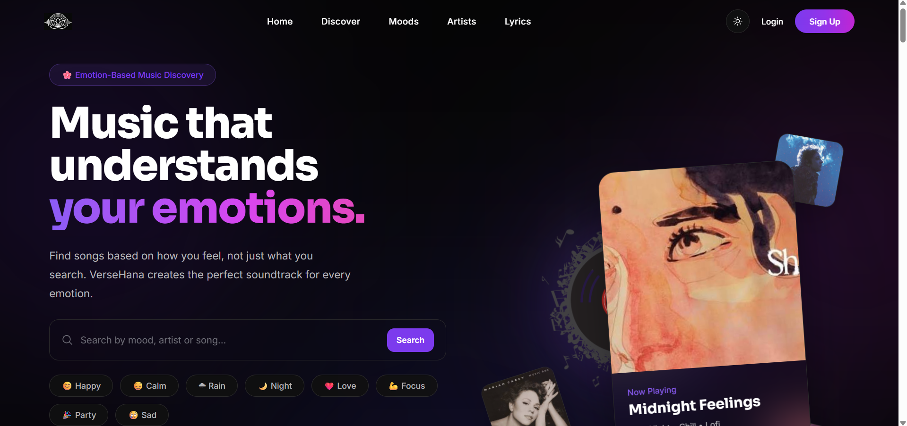
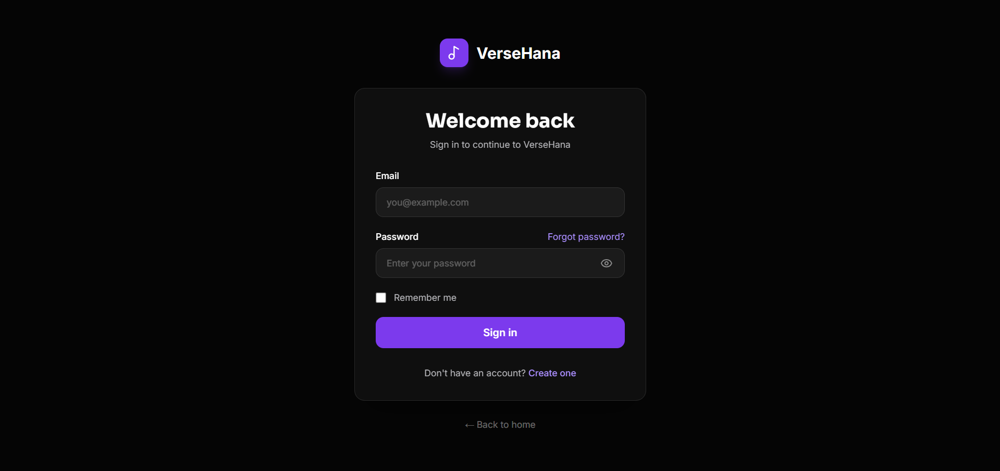
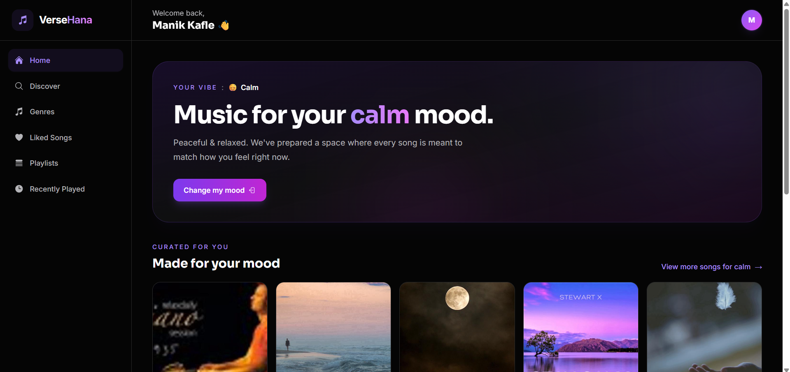
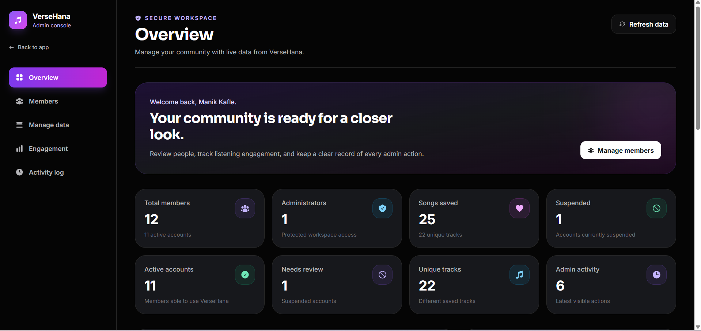

# 🎧 VerseHana

> **Music that understands your emotions.**

VerseHana is a modern, mood-driven music platform designed to make discovering music feel personal. Instead of simply browsing songs, users can explore music based on emotions, moods, artists, playlists, lyrics, and listening preferences.

Built as an academic project with a focus on **modern UI/UX, responsive design, authentication, music discovery, and full-stack web development**.

---

## ✨ Features

### 🎵 Music Discovery
- Browse trending music
- Discover songs by mood
- Search for songs and artists
- Explore curated playlists
- Browse music by genre
- View trending artists
- Play music through Audius

### 🎭 Mood-Based Discovery

VerseHana organizes music around emotions:

| Mood | Vibe |
|---|---|
| 😊 Happy | Bright & uplifting |
| 😌 Calm | Peaceful & relaxed |
| 🌧️ Rain | Cozy & reflective |
| 🌙 Night | Late-night vibes |
| ❤️ Love | Warm & emotional |
| 💪 Focus | Locked in |
| 🎉 Party | Energetic & fun |
| 😢 Sad | Emotional & reflective |

### 👤 User System
- User registration
- User login
- Authentication
- Protected user dashboard
- Profile management
- Mood selection
- Personalized user experience

### 📊 User Dashboard
- User profile
- Current mood
- Music activity
- Music discovery
- Responsive dashboard layout
- Mobile-friendly navigation

### 🛠️ Admin Dashboard
- Administrative interface
- Manage platform content
- Manage users and music-related data
- Dashboard statistics
- Separate admin experience

### 🎨 Modern UI/UX
- Cinematic dark interface
- Responsive layout
- Smooth animations
- Framer Motion interactions
- Mood-based visual design
- Mobile, tablet, laptop, and desktop support
- Light/Dark theme support

---

## 🧰 Tech Stack

### Frontend

- **React**
- **Vite**
- **Tailwind CSS**
- **Framer Motion**
- **React Icons**
- **React Router**

### Backend

- **Node.js**
- **Express.js**
- **REST API**
- **JWT Authentication**

### Database

- **MongoDB**
- **MongoDB Atlas**

### Music API

- **Audius API**

### Development & Deployment

- Git
- GitHub
- GitHub Pages / Vercel / Netlify for frontend deployment
- Render for backend deployment
- MongoDB Atlas for cloud database

---

## 🏗️ Project Architecture

```text
VerseHana
│
├── Frontend
│   ├── React
│   ├── Vite
│   ├── Tailwind CSS
│   ├── Framer Motion
│   └── React Router
│
├── Backend
│   ├── Node.js
│   ├── Express.js
│   ├── REST API
│   ├── Authentication
│   └── Audius Integration
│
└── Database
    └── MongoDB Atlas
```

---

## 📂 Project Structure

```text
VerseHana/
│
├── client/
│   ├── public/
│   ├── src/
│   │   ├── components/
│   │   ├── pages/
│   │   ├── context/
│   │   ├── data/
│   │   ├── hooks/
│   │   ├── services/
│   │   ├── styles/
│   │   └── main.jsx
│   │
│   ├── index.html
│   ├── package.json
│   └── vite.config.js
│
├── server/
│   ├── controllers/
│   ├── middleware/
│   ├── models/
│   ├── routes/
│   ├── services/
│   ├── config/
│   ├── server.js
│   └── package.json
│
├── .gitignore
├── README.md
└── package.json
```

> **Note:** Folder names may vary depending on the final project structure.

---

## 🔐 Authentication

VerseHana uses authentication to separate public landing-page content from protected application functionality.

```text
Visitor
   │
   ▼
Landing Page
   │
   ├── Browse landing page
   │
   └── Click protected content
            │
            ▼
         Login
            │
            ▼
        Dashboard
```

Authenticated users are automatically redirected to the dashboard instead of continuing to the public landing page.

---

## 🎧 Audius Integration

VerseHana uses the **Audius API** to retrieve music data.

The backend handles Audius requests and provides application-specific endpoints for the frontend.

Example endpoints:

```http
GET /api/music/trending
GET /api/music/search?q=...
GET /api/music/mood/:mood
GET /api/music/genre/:genre
```

### Mood Mapping

VerseHana maps its own mood system to Audius search parameters and fallback search terms.

```text
VerseHana Mood
      │
      ▼
Mood Mapping
      │
      ▼
Audius API
      │
      ▼
Music Results
      │
      ▼
VerseHana UI
```

---

## 🔎 Search Flow

```text
User enters search
        │
        ▼
Frontend
        │
        ▼
Backend API
        │
        ▼
Audius Search
        │
        ▼
Music Results
        │
        ▼
Music Cards
```

---

## 🌐 API Overview

### Trending Music

```http
GET /api/music/trending
```

### Search Music

```http
GET /api/music/search?q=artist-or-song
```

### Mood Music

```http
GET /api/music/mood/calm
GET /api/music/mood/happy
GET /api/music/mood/rain
```

### Genre Music

```http
GET /api/music/genre/pop
GET /api/music/genre/rock
GET /api/music/genre/lofi
```

---

## ⚙️ Environment Variables

Create a `.env` file where required.

Example:

```env
PORT=5000

MONGODB_URI=your_mongodb_connection_string

JWT_SECRET=your_jwt_secret

AUDIUS_API_KEY=your_audius_api_key

CLIENT_URL=http://localhost:5173
```

### ⚠️ Important

Never commit `.env` files or API keys to GitHub.

Make sure `.gitignore` contains:

```gitignore
.env
.env.*
!.env.example
```

---

## 🚀 Installation

### 1. Clone the repository

```bash
git clone https://github.com/YOUR_USERNAME/VerseHana.git
```

```bash
cd VerseHana
```

### 2. Install frontend dependencies

```bash
cd client
npm install
```

### 3. Install backend dependencies

```bash
cd ../server
npm install
```

### 4. Configure environment variables

Create the required `.env` files and add your:

- MongoDB connection
- JWT secret
- Audius API key
- Frontend URL

---

## ▶️ Run Locally

### Start backend

```bash
cd server
npm run dev
```

### Start frontend

Open another terminal:

```bash
cd client
npm run dev
```

The frontend will normally be available at:

```text
http://localhost:5173
```

The backend will normally run on:

```text
http://localhost:5000
```

---

## 🏭 Production Build

Build the frontend:

```bash
npm run build
```

Preview the production build:

```bash
npm run preview
```

---

## ☁️ Deployment

A typical deployment architecture for VerseHana is:

```text
                 ┌─────────────────┐
                 │     GitHub      │
                 └────────┬────────┘
                          │
             ┌────────────┴────────────┐
             ▼                         ▼
      ┌─────────────┐           ┌─────────────┐
      │  Frontend   │           │   Backend   │
      │ Vercel /    │           │   Render    │
      │ Netlify     │           │             │
      └──────┬──────┘           └──────┬──────┘
             │                         │
             │                         ▼
             │                  ┌─────────────┐
             │                  │   MongoDB   │
             │                  │    Atlas    │
             │                  └─────────────┘
             │
             ▼
       VerseHana Website
```

Environment variables must be configured separately on the deployment platform.

---

## 📱 Responsive Design

VerseHana is designed to work across:

```text
📱 Mobile
      ↓
📱 Large Mobile
      ↓
📟 Tablet
      ↓
💻 Laptop
      ↓
🖥️ Desktop
      ↓
🖥️ Large Desktop
```

The interface uses responsive layouts, flexible grids, scalable typography, and mobile-friendly navigation.

---

## 🎨 Design System

### Primary Colors

```text
Background       #050505
Surface          #0F0F10
Card             #17181C

Primary Text     #FFFFFF
Secondary Text   #B4B4B8
Muted Text       #71717A

Accent           #8B5CF6
Secondary Accent #38BDF8

Border           #2A2A2A
```

### Typography

```text
Headings → Sora
Body     → Inter
Lyrics   → Cormorant Garamond
```

The design focuses on:

- Cinematic visuals
- Dark surfaces
- Purple/fuchsia gradients
- Large typography
- Soft background glows
- Smooth motion
- Emotion-driven presentation

---

## 🖼️ Screenshots

### Landing Page



### Login



### User Dashboard



### Admin Dashboard



```

Recommended screenshot folder:

```text
screenshots/
├── landing-page.png
├── login.png
├── dashboard.png
└── admin-dashboard.png
```

---

## 🔒 Security

VerseHana follows basic security practices including:

- Environment variables for secrets
- JWT-based authentication
- Protected routes
- Server-side API handling
- CORS configuration
- `.env` excluded from Git
- API keys kept on the backend

Never expose private API keys directly in frontend code.

---

## 🎯 Project Objectives

The main objectives of VerseHana are:

1. Build a modern music discovery platform.
2. Introduce mood-based music discovery.
3. Create a responsive and visually engaging interface.
4. Implement user authentication.
5. Integrate a real music API.
6. Build a functional user dashboard.
7. Build an administrative dashboard.
8. Develop a complete full-stack web application.
9. Practice real-world deployment and API integration.

---

## 🌟 What Makes VerseHana Different?

Traditional music platforms generally organize discovery around:

```text
Song → Artist → Genre
```

VerseHana adds another layer:

```text
Emotion
   ↓
Mood
   ↓
Music
   ↓
Personal Experience
```

Instead of asking:

> **"What song do you want?"**

VerseHana focuses on:

> **"How do you feel?"**

This mood-first approach is the core idea behind the platform.

---

## 🔮 Future Improvements

Possible future versions of VerseHana could include:

- AI-powered mood detection
- AI-generated playlists
- Real-time lyrics synchronization
- Personalized recommendations
- Listening history
- Favorites and liked songs
- Custom playlists
- Social sharing
- Follow artists
- Music statistics
- Advanced audio player
- Offline listening
- Mobile application
- Push notifications
- More advanced recommendation algorithms

---

## 🧪 Future AI Recommendation Concept

A future recommendation system could work like:

```text
User Activity
     │
     ├── Listening History
     ├── Selected Mood
     ├── Favorite Artists
     ├── Genres
     └── Search History
            │
            ▼
      Recommendation Engine
            │
            ▼
       Personalized Music
```

---

## 🎓 Academic Project

**Project:** VerseHana  
**Type:** Full-Stack Web Application  
**Domain:** Music & Entertainment  
**Semester:** 7th Semester Project

The project demonstrates practical implementation of:

- Frontend development
- Backend development
- Database integration
- REST APIs
- Authentication
- Third-party API integration
- Responsive UI/UX
- Cloud deployment
- Git/GitHub workflow

---

## 👨‍💻 Developer

Developed as a Computer Engineering academic project.

**VerseHana — Music that understands your emotions. 🎧**

---

## 🙏 Acknowledgements

Special thanks to the technologies and services used to build VerseHana:

- [React](https://react.dev/)
- [Vite](https://vite.dev/)
- [Tailwind CSS](https://tailwindcss.com/)
- [Framer Motion](https://motion.dev/)
- [React Icons](https://react-icons.github.io/react-icons/)
- [Node.js](https://nodejs.org/)
- [Express.js](https://expressjs.com/)
- [MongoDB](https://www.mongodb.com/)
- [MongoDB Atlas](https://www.mongodb.com/atlas)
- [Audius](https://audius.co/)

---

## 📄 License

This project was developed for academic and educational purposes.

Copyright © 2026 VerseHana.
